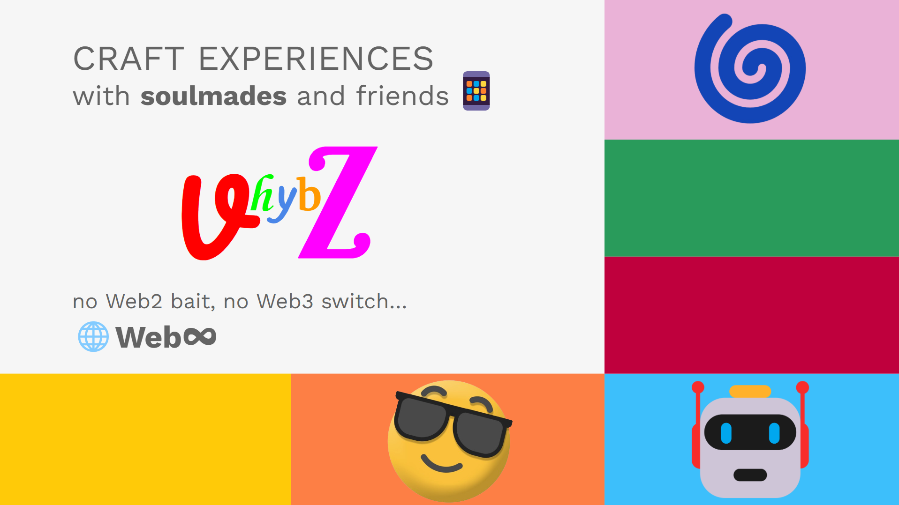

# **vhybZ**: The Experience Platform for the Agentic Web

> **TL;DR:** vhybZ is a new kind of platform where anyone can co-create dynamic, multimodal digital experiences alongside AI, going far beyond chatbot text walls or static apps.

ChatGPT didn’t dominate because it had the most advanced language model; it won because it delivered a radically new experience. In just months, it became a fixture on millions of devices worldwide, making AI feel accessible, useful, and universal. It clearly demonstrated what’s possible when experience becomes the product.

**vhybZ** is the next leap in that direction: we’re commoditizing "Experience Creation" itself, supercharged by the latest advances in AI modality.

*Multimodal Input in vhybZ*

At its core, vhybZ is a mobile app that, at first glance, resembles a chatbot interface. But unlike typical chatbots, each session in vhybZ is the start of something new, a creation brought to life. Whether it’s a collaborative art piece, an interactive learning journey, or an agentic mobile app experience, vhybZ is where users and AIs co-create, not just consume.

We're not talking AI slop or soulless automation, nor is it just another **"Vibe Coding"** tool. vhybZ is where human creativity and agentic intelligence merge, a true "humagentic" society, where the best of both worlds combine to shape, remix, and own living digital realities. We’re building the operating system for purposeful interaction, where anyone can become an architect of dynamic, evolving experiences. This is the end of the text wall era. vhybZ experiences are dynamic, time-based, and multimodal, crafted and evolved through a novel layer of memory and agency.

> vhybZ is where anyone, with AI, can remix living digital realities.

---

## The User Journey: From Prompt to Experience

Picture this: You want to make egg fried rice. Instead of reading a recipe, you launch an Egg Fried Rice Experience. Your soulmades tune the experience specifically for your setting, and guide you interactively, showing techniques, suggesting timings, and helping you troubleshoot. Every tap, voice, or camera input becomes part of a living, remixable journey.

- **Minimalist Home**: No doomscrolling, just your Experiences and creative sparks.
- **Persistent Input**: Instantly switch between text, voice, or camera.
- **Multimodal Responses**: Rich, interactive feedback, never just a wall of text.
- **Remix & Attribution**: Everything you create is yours, remixable and credited.

---

## Why Experiences, Not Just Responses?

AI today is reactive, stateless, and forgettable. Chatbots answer, image generators spit out assets, but there’s no sense of continuity, memory, or true agency. vhybZ breaks the cycle. Here, experiences are alive, unfolding over time, blending text, voice, visuals, and more, all backed by **soulmades**: not agents, but the living/evolving memory layer that gives meaning and persistence to everything you do.

---

## Soulmades & SOUL: Living Memory, Creative Lineage

At the heart of vhybZ is SOUL (Specific and Objective Understanding Logic), our open framework for building meta-agents called **soulmades**. Soulmades are not just reasoning engines; they are living nodes in your digital memory, weaving together state, context, and creative lineage. With SOUL, meta-agents transcend simple logic: they adapt, evolve, and amplify your intent, reaching for understanding, empathy, and even emotion as they collaborate with you.

Soulmades maintain and upgrade your experiences you create, on autopilot. Learning from every interaction and remix. They enable:
- **Purposeful Agency**: Acting when it matters, not just when prompted.
- **Multimodal Creation**: Blending text, voice, visuals, and more.
- **Society of Minds**: Systems of interacting soulmades, each with unique drives and perspectives.
- **Extensible Intelligence**: Plug in your own LLMs, knowledge, and skills.

> SOUL Framework: [GitHub link](https://github.com/vhybZApp/SOUL)

---

## Confidant: Give your experience sensors and motors!

While soulmades excel at reasoning, co-creation, and managing experiences within the vhybZ canvas, their agency needs to extend beyond it. **Confidant** is the SOUL-compatible component designed to bridge this gap, equipping soulmades with the "hands and eyes" necessary to perceive and act upon the broader digital and physical world.

> Confidant implementation: [GitHub Link](https://github.com/vhybZApp/confidant)

Think of Confidant as the practical enabler of intentions. It operates as a highly performant, cross-platform service (built in Go) that translates a soulmade's agenda into concrete actions outside the vhybZ app:

*   **Digital Dexterity:** Interacting with existing desktop applications, web interfaces, or operating system elements via programmatic control of mouse, keyboard, and screen analysis.
*   **Physical Embodiment:** Providing the interface layer to control peripherals connected to desktop or edge devices, extending soulmades' agency to robotics or IoT interactions.
*   **Cross-App Synergy:** Acting as a coordination point allowing soulmades to orchestrate tasks across multiple, disparate applications based on user prompts or their internal agenda.

Confidant allows soulmades, guided by SOUL's logic, to not only *reason* but also *do*: automating workflows, controlling devices, and interacting with legacy systems, truly injecting autonomy into existing apps without requiring deep integration.

### Confidant demo video:

---

## The vhybZ Vision: From Passive to Purposeful

vhybZ is the Experience Canvas for the next era of digital creation. Our mission: to make purposeful AI agency and living memory accessible, composable, and a joy to use. We empower:
- **Creators & Power Users**: Build rich, stateful Experiences and memory flows without wrestling with code or clunky frameworks.
- **Developers**: Drop in agentic intelligence, multimodal Experiences, and persistent memory, no need to reinvent the wheel.
- **Everyone**: Personalize your digital world, remix Experiences just as you would stories, and own your creative and cognitive lineage.

---

## Why Now? The World is Ready for Agentic Creation

- **Multimodal AI is here**, but the interfaces are stuck in the past.
- **Chatbot fatigue is real**, users want partners, not parrots.
- **Agency & Creativity matter**, people crave tools to co-create, not just consume.
- **Remix culture is booming**, vhybZ is the platform for collaborative, evolving digital realities.

---

## What Makes vhybZ Different?

- **Experiences, not responses**: Time-based, interactive, and co-created.
- **Commons & Remixability**: Every creation is a node in the Morphic Consensus Graph, attributed, remixable, and evolving.
- **Plug-and-play extensibility**: From LLMs to custom skills, vhybZ is modular by design.
- **Intuitive, not intimidating**: Craft, remix, and collaborate, no prompt engineering degree required.

---

## Under the Hood: Architecture for the Agentic Web

- **Frontend**: vhybZ app (Android/iOS/web), a portal for Experiences.
- **Runtime**: vhybRunt engine renders and mediates all interactions.
- **Agents**: Your soulmades, powered by SOUL, always learning and adapting.
- **Backend**: Lattice for distributed compute/storage, MCP for protocol, MCG for knowledge.
- **Commons**: Every Experience, remix, and knowledge fragment is discoverable, remixable, and attributed.

---

## Ready to Experience Web∞?

The future isn’t static pages or endless chatbot prompts, it’s dynamic, agentic Experiences you shape with AI partners. vhybZ is your invitation to co-create, remix, and set your creativity on autopilot.

Are you ready to build, not just browse?

> [Slide Deck](https://docs.google.com/presentation/d/1p1c9kmE_RnRwzP9QSpuyXlgHcrVJuRWm2eA_dYIztqU/edit?usp=sharing)
>
> Explore the future at [vhybz.com](https://vhybz.com) | Contact: hi@vhybz.com

*Team: Built by AGI pioneers, practical engineers, and creators who believe the web should serve your purpose, not the other way around.*

*Let’s build the Interaction Layer for Purposeful AI, together.*
